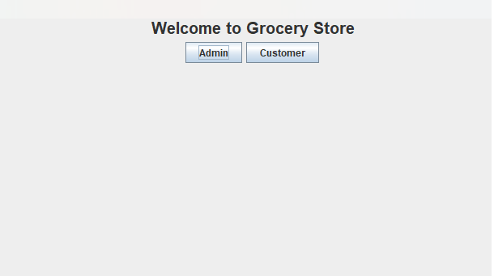
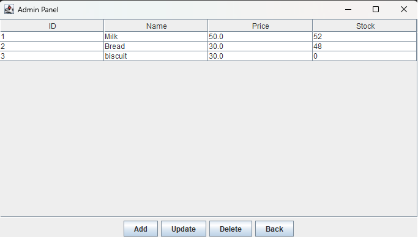
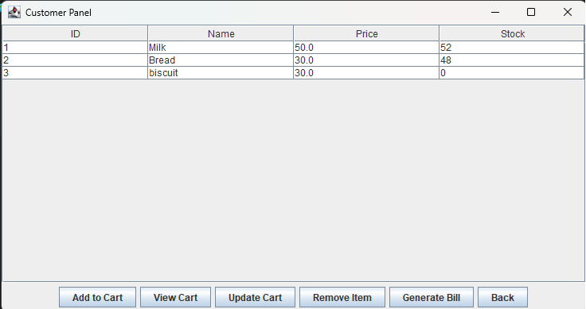

# 🛒 Grocery Management System


👩‍💻 **Developed by:** Mohini Kuthe — MCA Student | Aspiring Java Developer

---

## 📸 Application Preview






## 📌 About

A desktop-based **Grocery Management System** built with **Java Swing** and **SQLite**. It provides separate panels for Admin and Customers, along with an automated billing system.

---

## 📋 Table of Contents

- [Features](#-features)
- [Technologies Used](#️-technologies-used)
- [Project Structure](#-project-structure)
- [How to Run](#️-how-to-run)
- [Learning Outcomes](#-learning-outcomes)
- [Future Improvements](#-future-improvements)

---

## 🚀 Features

### 👨‍💼 Admin Panel
- Add new products to inventory
- Update product price and stock quantity
- Delete products
- View full inventory in table format

### 🛍️ Customer Panel
- Browse available products
- Add items to cart
- Update or remove cart items
- Generate bill at checkout

### 🧾 Billing System
- Auto bill generation with customer name, product details, quantity & total
- Automatic discount applied for orders above ₹1000
- Bills saved as `.txt` files inside the `Bills/` folder
- All data persisted in SQLite database

---

## 🛠️ Technologies Used

| Technology | Purpose |
|------------|---------|
| Java (Core Java) | Application logic |
| Java Swing | GUI / Desktop Interface |
| SQLite | Local database storage |
| JDBC | Java–Database connectivity |

---

## 📂 Project Structure

```
GroceryDBProject/
│
├── src/
│   └── com/myname/grocery/
│       └── ColorfulGroceryGUI.java   # Main application file
│
├── Bills/
│   └── Bill_XXXX.txt                 # Auto-generated bill files
│
├── grocery.db                        # SQLite database
├── .classpath                        # Eclipse classpath config
├── .project                          # Eclipse project config
└── README.md                         # Project documentation
```

---

## ▶️ How to Run

### Prerequisites
- Java JDK 8 or higher
- Eclipse IDE (or IntelliJ IDEA)
- SQLite JDBC Driver ([Download here](https://github.com/xerial/sqlite-jdbc/releases))

### Steps

1. **Clone the repository**
   ```bash
   git clone https://github.com/your-username/GroceryDBProject.git
   ```

2. **Open in Eclipse**
   - Go to `File → Import → Existing Projects into Workspace`
   - Select the cloned folder

3. **Add SQLite JDBC Driver**
   - Right-click project → `Build Path → Add External JARs`
   - Select the downloaded `sqlite-jdbc.jar`

4. **Run the project**
   - Open `ColorfulGroceryGUI.java`
   - Click the **Run** button ▶️

5. **Login**
   - **Admin** → Password: `admin123`
   - **Customer** → Select customer login

---

## 🧠 Learning Outcomes

- GUI development using Java Swing
- Relational database design and integration
- CRUD operations with JDBC
- File handling in Java
- Basic billing and discount logic

---

## 🔮 Future Improvements

- [ ] View and search previous bills
- [ ] Filter and search products
- [ ] Export bill as PDF
- [ ] Improved UI using JavaFX
- [ ] User authentication for customers
